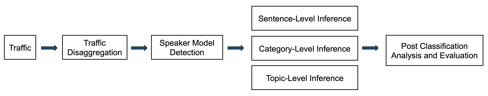

# 
VoiceAttack: Fingerprinting Voice Command on VPN-Protected Smart Home Speakers

Xiaoguang Guo, Keyang Yu, Qi Li, Dong Chen

 

In Proc. of the 11th ACM International Conference on Systems for Energy-Efficient Buildings, Cities, and Transportation (ACM BuildSys 2024).

 

Recently, there are growing security and privacy concerns regarding smart voice speakers, such as Amazon Alexa and Google Home. Extensive prior research has shown that it is surprisingly easy to infer Amazon Alexa voice commands over their network traffic data. To prevent these traffic analytics (TA)-based inference attacks, smart home owners are considering deploying virtual private networks (VPNs) to safeguard their smart speakers. In this work, we design a new machine learning (ML) and deep learning (DL)-powered attack framework---VoiceAttack that could still accurately fingerprint voice commands on VPN-encrypted voice speaker network traffic. We evaluate VoiceAttack under 5 different real-world settings using Amazon Alexa and Google Home. Our results show that VoiceAttack could correctly infer voice command sentences with a Matthews Correlation Coefficient (MCC) of 0.68 in a closed-world setting and infer voice command categories with an MCC of 0.84 in an open-world setting by eavesdropping VPN-encrypted network traffic rates. This presents a significant risk to user privacy and security, as it suggests that external on-path attackers could still potentially intercept and decipher users' voice commands despite the VPN encryption. We then further examine the sensitivity of voice speaker commands to VoiceAttack. We find that 134 voice speaker commands are highly vulnerable to VoiceAttack and 3 commands are less sensitive. We also present a proof-of-concept defense approach---VoiceDefense, which could effectively mitigate TA attack accuracy on Amazon Echo and Google Home by ~50%.

 

 
    
    
The system pipeline of VoiceAttack

## Datasets

[VoiceAttack Dataset](https://www.kaggle.com/datasets/xiaoguangguo/voiceattack)

